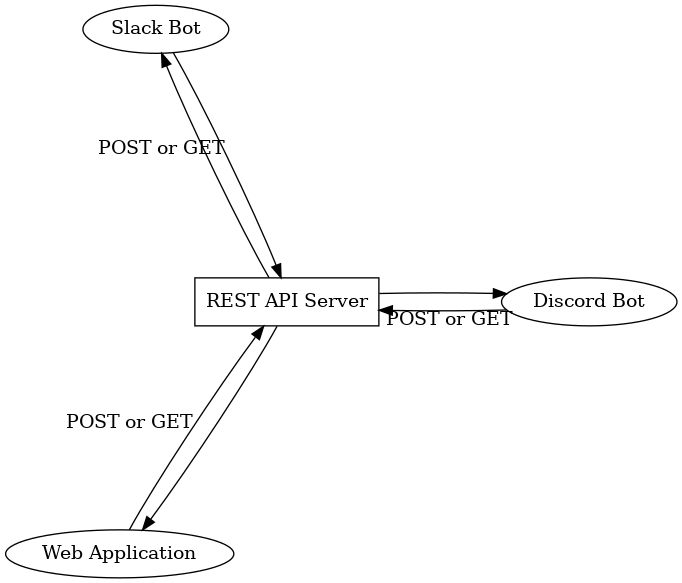

# SLGs 持続可能な生活の目標

生活を回すためのソフトウェア群です

1. 今やらなければならないことの整理
2. 未来の予定の構築と通知
3. 過去のデータの整理と分析

の3つをできるようにすることが目標です

# ソフトウェア構成

中心としてREST APIを提供するwebサーバーを構築します。

それを利用する形で

- Discord Bot
- Slack Bot
- Webアプリ

などを構築します（予定）

# 関係リポジトリ

REST APIを提供するWebサーバー：

- [SLGs-REST-API](https://github.com/kiai-life/SLGs-REST-API)
